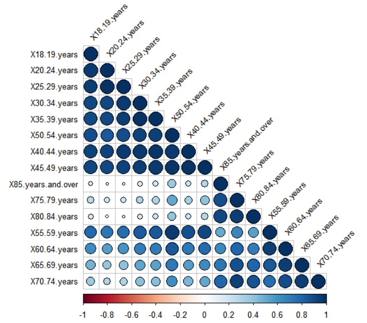

#Marriage Equality Referendum Data

##Research question 1: Who participated the vote?
### Participation basic information-gender and state

![text] (No_ResBas.jpeg)

##Research question 2: Are different age groups correlated based on their participation patterns?
### See the detail of age

##Research question 3: What states had the highest and lowest “Yes” votes?

We wanted to know the percentage of people that voted Yes and No in each state.

The graphs below show that ACT had the highest percentage of Yes votes in the country!
Victoria came in second :)

New South Wales had the highest percentage of No voters.

##Research question 4: Can gender or age predict the “Yes” vote?

We did not have the “Yes” vote data broken down by age or gender unfortunately...
But...statistics!
We wondered if we could relate the participation rates broken down by gender and age to the outcome of the vote in each electorate.  
Turns out we can! 

Using linear regression we found a significant relationship between the gender ratio (female to male) of those who participated and the outcome in the electorate. The more women that participated compared to men, the higher the rate of YES votes.
Outliers of note: Sydney had a lower female ratio of participation but still very high yes votes.
Disclaimer: Of course we cannot say that women voted yes more, as we do not have that data.  There could be other variables involved (such as urban versus rural, age etc.) that influence both gender ratios and yes voting.
But still quite interesting! :)

This plot looks at the rate of 25-29 year olds compared to other age groups and whether that is related to “Yes” votes.
The higher the amount of 25-29yr-olds in an electorate the higher the rate of “Yes” votes.

Another take-away from this graph is that it looks like NSW may be a polarised state, it has some of the highest and lowest rates of “Yes” voting.

Finally we examined whether the amount of the oldest Australians (over 85) voting in an electorate influenced the YES vote.
There was no relationship with the levels of over 85s and the outcome.

##Research question 5:Can different FED be correlated based on their participation patterns - Cluster analysis?
### Cluster 

